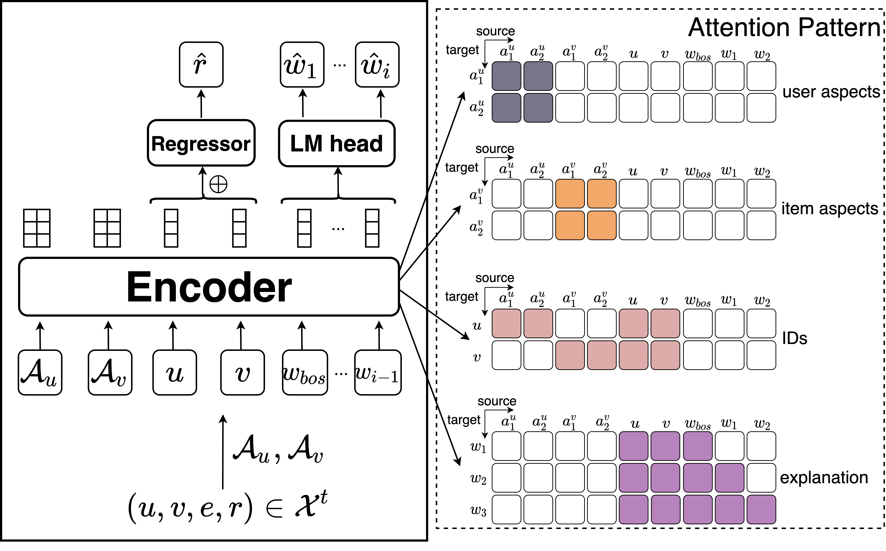
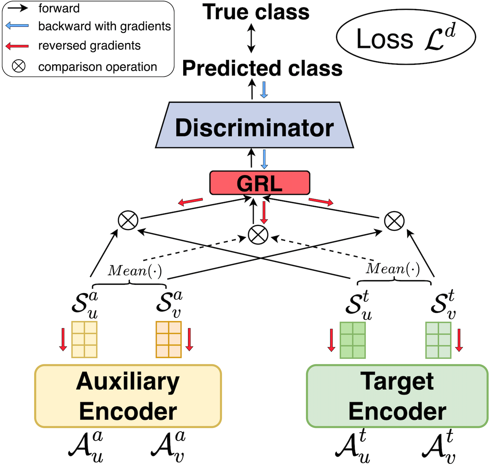

# AdaRex
This is the repository containing the code for the SIGIR-AP 2023 paper "AdaReX: Cross-Domain, Adaptive and Explainable Recommender System". 

We propose AdaReX (Adaptive eXplainable Recommendation), to model auxiliary and target domains simultaneously. By performing specific tasks in respective domains and their interconnection via a discriminator model, AdaReX allows the aspect sequences to learn common knowledge across different domains.

